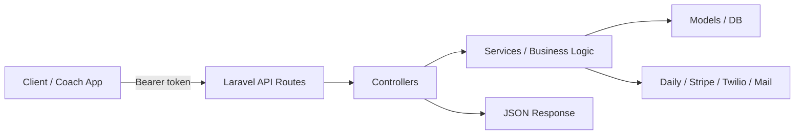
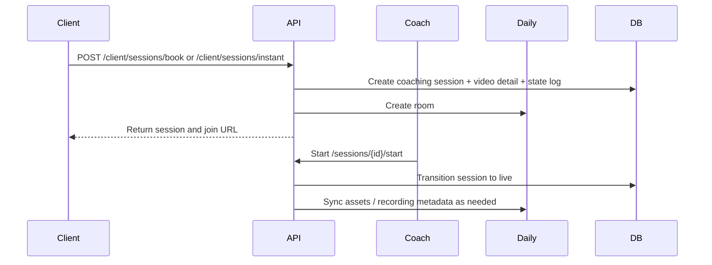
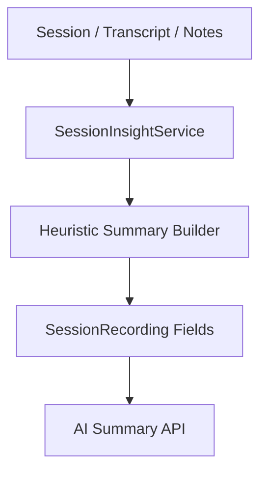

# Gottanew Backend API Documentation

## 1. Purpose and scope
This document captures the current Laravel backend API surface for GottDo, including authentication, session workflows, coach management, finance, notifications, webhooks, and the existing AI-related endpoints. It is written as a client handoff artifact for integration planning and future AI upgrades.

Base URL: `/api/v1`

## 2. Architecture snapshot

### Runtime stack
- Laravel 10-style backend with Sanctum authentication
- Controller-service-model structure
- JSON responses via a shared base controller
- MySQL by default, with Laravel database/queue/session config present

### Main modules
- Auth and profile management
- Coach discovery, onboarding, availability, and packages
- Client goals, tasks, session requests, and session booking
- Session portal, recording, notes, feedback, collaboration, and consent
- Finance wallet, transactions, coin packages, and Stripe-based checkout
- Admin operations for coaches, transcripts, finance, and session approvals
- Notification delivery and webhook handling
- AI-oriented summary and coach-matching endpoints

### Request flow


### Session flow


## 3. Authentication and authorization

### Authentication
- Uses Laravel Sanctum personal access tokens.
- Protected endpoints require `auth:sanctum`.

### Authorization roles
- Admin endpoints require `auth:sanctum` and `role:admin`.
- Coach-only operations are enforced by resolving the authenticated user’s coach profile.
- Some public endpoints are intentionally open for coach discovery, availability lookup, and invitations.

### Common response structure
Successful responses follow:
```json
{
  "success": true,
  "message": "Success",
  "data": {}
}
```

Error responses follow:
```json
{
  "success": false,
  "message": "Error"
}
```

## 4. Endpoint inventory

### 4.1 Auth and profile
| Method | Endpoint | Auth | Purpose |
|---|---|---|---|
| POST | `/auth/register` | Public | Create a client or coach account and initialize wallet/profile/coach record |
| POST | `/auth/login` | Public | Authenticate user and issue Sanctum token |
| POST | `/auth/coach-apply` | Public | Submit a coach application |
| POST | `/auth/set-password` | Public | Set password from an invitation flow |
| POST | `/auth/forgot-password` | Public | Create password reset token and send email |
| POST | `/auth/reset-password` | Public | Reset password using token |
| POST | `/auth/logout` | Auth | Revoke tokens |
| GET | `/auth/profile` | Auth | Fetch current user profile |
| PUT | `/auth/profile` | Auth | Update profile details and legal acceptance flags |
| DELETE | `/auth/profile/transcripts` | Auth | Delete associated session transcripts and summaries |

### 4.2 Client module
| Method | Endpoint | Auth | Purpose |
|---|---|---|---|
| GET | `/client/goals` | Auth | List user goals with tasks |
| POST | `/client/goals` | Auth | Create a goal |
| DELETE | `/client/goals/{goal}` | Auth | Delete a goal |
| POST | `/client/tasks` | Auth | Create a task under a goal |
| PUT | `/client/tasks/{task}` | Auth | Update a task |
| DELETE | `/client/tasks/{task}` | Auth | Delete a task |
| GET | `/client/sessions` | Auth | List sessions for the client |
| POST | `/client/sessions/book` | Auth | Book a scheduled session |
| POST | `/client/sessions/instant` | Auth | Book an instant session |
| GET | `/client/sessions/{id}` | Auth | Fetch a specific session |
| GET | `/client/session-requests` | Auth | List connection/session requests |
| POST | `/client/session-requests` | Auth | Submit a free-intro connection request |

### 4.3 Coach module
| Method | Endpoint | Auth | Purpose |
|---|---|---|---|
| GET | `/coach/coaches` | Public | List active coaches |
| GET | `/coach/coaches/{id}` | Public | Fetch coach profile |
| GET | `/coach/coaches/{id}/availability` | Public | Get public availability summary |
| GET | `/coach/coaches/{id}/available-slots` | Public | Get available date slots |
| GET | `/coach/invitation/{token}` | Public | Validate invitation token |
| POST | `/coach/onboarding/complete` | Public | Complete coach onboarding |
| GET | `/coach/coaches/{id}/packages` | Public | List active coaching packages for a coach |
| GET | `/packages` | Public | List coaching packages |
| POST | `/packages` | Auth | Create a package |
| GET | `/packages/{id}` | Public | Fetch a package |
| PUT | `/packages/{id}` | Auth | Update a package |
| DELETE | `/packages/{id}` | Auth | Delete a package |
| POST | `/coach/match` | Public/optional auth | Match a coach to a goal and response context |
| GET | `/coach/profile` | Auth | Current coach profile |
| PUT | `/coach/profile` | Auth | Update coach profile |
| GET | `/coach/coaches/{id}/session-pricing` | Auth | Estimate pricing for a coach |
| GET | `/coach/availability` | Auth | List authenticated coach’s availability |
| POST | `/coach/availability` | Auth | Create availability block |
| PUT | `/coach/availability/{id}` | Auth | Update availability block |
| DELETE | `/coach/availability/{id}` | Auth | Delete availability block |
| GET | `/coach/earnings` | Auth | List earnings |
| GET | `/coach/sessions` | Auth | List coach sessions |
| GET | `/coach/sessions/{id}` | Auth | Fetch a coach session |
| PUT | `/coach/sessions/{id}/notes` | Auth | Save coach notes |
| POST | `/coach/sessions/{id}/start` | Auth | Start a session |

### 4.4 Admin module
| Method | Endpoint | Auth | Purpose |
|---|---|---|---|
| GET | `/admin/users` | Admin | List users |
| GET | `/admin/coaches` | Admin | List coaches |
| GET | `/admin/pending-applications` | Admin | List pending coach applications |
| POST | `/admin/coaches/invite` | Admin | Invite a coach |
| PUT | `/admin/coaches/{id}/status` | Admin | Update coach status |
| POST | `/admin/approve-coach/{id}` | Admin | Approve pending coach application |
| GET | `/admin/session-requests` | Admin | List session requests |
| GET | `/admin/session-requests/assignable-coaches` | Admin | Get assignable coaches |
| POST | `/admin/session-requests/{id}/approve` | Admin | Approve a session request |
| POST | `/admin/session-requests/{id}/reject` | Admin | Reject a session request |
| GET | `/admin/sessions` | Admin | List sessions |
| GET | `/admin/failed-sessions` | Admin | List failed sessions |
| GET | `/admin/transcripts` | Admin | List transcripts |
| GET | `/admin/transcripts/{id}` | Admin | Fetch transcript |
| GET | `/admin/transcripts/{id}/verify-daily` | Admin | Verify Daily transcript data |
| POST | `/admin/transcripts/{id}/sync` | Admin | Sync transcript from Daily |
| POST | `/admin/transcripts/{id}/generate-summary` | Admin | Generate summary for transcript |
| GET | `/admin/delivery-logs` | Admin | List notification delivery logs |
| GET | `/admin/finance/overview` | Admin | Finance overview |
| GET | `/admin/client-wallets` | Admin | List client wallets |
| GET | `/admin/token-grants` | Admin | List token grants |
| POST | `/admin/token-grants` | Admin | Grant tokens |
| GET | `/admin/payout-cycles` | Admin | List payout cycles |
| POST | `/admin/payout-cycles/generate` | Admin | Generate payout cycle |
| POST | `/admin/payout-cycles/{id}/approve` | Admin | Approve payout cycle |
| POST | `/admin/payout-cycles/{id}/mark-paid` | Admin | Mark payout paid |

### 4.5 Session portal and collaboration
| Method | Endpoint | Auth | Purpose |
|---|---|---|---|
| GET | `/sessions/{id}/stream` | Public | Stream collaboration content |
| GET | `/sessions/{id}` | Auth | Fetch session portal payload |
| GET | `/sessions/{id}/join` | Auth | Join session |
| GET | `/sessions/{id}/video` | Auth | Alias for join |
| GET | `/sessions/{id}/validate` | Auth | Validate session access |
| POST | `/sessions/{id}/reconnect` | Auth | Reconnect to a session |
| POST | `/sessions/{id}/interrupt` | Auth | Mark session interrupted |
| POST | `/sessions/{id}/recover` | Auth | Recover session |
| POST | `/sessions/{id}/state` | Auth | Update session state |
| PUT | `/sessions/{id}/notes` | Auth | Save notes |
| POST | `/sessions/{id}/end` | Auth | End a session |
| POST | `/sessions/{id}/feedback` | Auth | Save feedback |
| POST | `/sessions/{id}/coach-response` | Auth | Save a coach response |
| GET | `/sessions/{id}/messages` | Auth | List session messages |
| POST | `/sessions/{id}/messages` | Auth | Send a session message |
| GET | `/sessions/{id}/resources` | Auth | List session resources |
| POST | `/sessions/{id}/resources` | Auth | Upload/store a resource |
| DELETE | `/sessions/{id}/resources/{resourceId}` | Auth | Delete a resource |
| POST | `/sessions/{id}/consent` | Auth | Save consent |
| PUT | `/sessions/{id}/recording` | Auth | Update recording metadata |
| POST | `/sessions/{id}/sync-daily-assets` | Auth | Sync Daily room/recording assets |

### 4.6 Finance and payments
| Method | Endpoint | Auth | Purpose |
|---|---|---|---|
| GET | `/finance/wallet` | Auth | Fetch wallet |
| POST | `/finance/wallet/deposit` | Auth | Add coins to wallet |
| GET | `/finance/transactions` | Auth | List transactions |
| GET | `/coin-packages` | Auth | List available coin packages |
| POST | `/coins/purchase` | Auth | Create Stripe checkout session |
| POST | `/payments/verify` | Auth | Verify checkout and credit wallet |

### 4.7 Goals, questions, responses, personality, analytics
| Method | Endpoint | Auth | Purpose |
|---|---|---|---|
| GET | `/goals` | Public | List goals |
| GET | `/goals/{id}` | Public | Fetch one goal |
| POST | `/goals` | Public | Create goal |
| PUT | `/goals/{id}` | Public | Update goal |
| DELETE | `/goals/{id}` | Public | Delete goal |
| GET | `/questions/{goal}` | Public | Fetch questions for a goal |
| POST | `/responses` | Public | Store a user response |
| POST | `/personality` | Public | Store personality/assessment data |
| GET | `/analytics/dashboard` | Public | Fetch analytics dashboard |

### 4.8 Notifications
| Method | Endpoint | Auth | Purpose |
|---|---|---|---|
| GET | `/notifications/stream` | Public/optional auth | SSE stream of notifications |
| GET | `/notifications` | Auth | List notifications |
| GET | `/notifications/unread-count` | Auth | Get unread count |
| POST | `/notifications/mark-all-read` | Auth | Mark all as read |
| POST | `/notifications/{id}/read` | Auth | Mark one notification as read |

### 4.9 Webhooks
| Method | Endpoint | Auth | Purpose |
|---|---|---|---|
| POST | `/webhooks/daily` | Public | Receive Daily room/transcription/webhook events |
| POST | `/webhooks/twilio/messaging-status` | Public | Receive Twilio messaging status callbacks |

## 5. AI endpoints and current logic

### 5.1 Summary generation endpoints
| Method | Endpoint | Auth | Current behavior |
|---|---|---|---|
| GET | `/ai/sessions/{id}/summaries` | Auth | Return pre-session summary, post-session summary, ai summary, next actions, key topics, personality insights |
| POST | `/ai/sessions/{id}/generate-pre-summary` | Auth | Build a pre-session summary from goals, questionnaire responses, and coach context |
| POST | `/ai/sessions/{id}/generate-post-summary` | Auth | Build post-session summary and action items from transcript/notes |

### 5.2 Coach matching endpoints
| Method | Endpoint | Auth | Current behavior |
|---|---|---|---|
| POST | `/ai/coach-matching` | Public | Query coaches by specialty goal and rank them with a lightweight score |
| POST | `/coach/match` | Public/optional auth | Similar matching logic using responses and optional personality profile |

### 5.3 Current AI implementation status
The current AI behavior is not powered by a live LLM provider. The backend uses rule-based and heuristic logic stored in the session insight service.

Notable findings:
- Summary generation is deterministic and based on available structured context.
- The service reads user goals, questionnaire responses, transcript text, coach notes, and client notes.
- It writes results into session recording fields such as `pre_session_summary`, `post_session_summary`, `ai_summary`, `next_actions`, `key_topics`, `personality_insights`.
- Coach matching is a simple scoring approach based on specialty match, experience, and rating.

### 5.4 Hardcoded or heuristic patterns
Examples from the implementation:
- Pre-session summary uses hard-coded focus points and prompt templates.
- Post-session summary uses keyword-based sentence extraction and simple action item heuristics.
- Keyword extraction uses a hard-coded stopword list.
- Coach matching uses fixed scoring weights rather than semantic similarity or learned ranking.

### 5.5 Recommended integration point for Hermes AI
Recommended insertion points for a more capable AI layer:
1. Summary generation pipeline for pre-session and post-session insights.
2. Action item extraction and coaching recommendations from transcript text.
3. Coach matching using semantic embeddings, response similarity, and personality compatibility.
4. Coach assistant prompt generation for real-time support during a session.

### AI flow sketch


## 6. Key services and integrations

### Daily.co
Used for:
- Room creation
- Room join URLs
- Recording/transcription syncing
- Asset sync hooks

### Stripe
Used for:
- Checkout session creation
- Checkout verification
- Wallet crediting after successful payment

### Twilio
Used for:
- SMS and WhatsApp messaging
- Messaging status callback validation and processing

### Email / notification delivery
Used for:
- Password reset emails
- Coach application notifications
- Session and admin notifications
- Internal delivery log tracking

## 7. Major database touchpoints
The main persistent concepts in the backend include:
- `users`, `profiles`, `user_roles`
- `coaches`, `coach_availability`, `coaching_packages`
- `coaching_sessions`, `session_recordings`, `session_state_logs`, `session_requests`
- `user_goals`, `user_tasks`
- `user_responses`, `guest_sessions`
- `user_wallets`, `transactions`, `coin_packages`
- `user_notifications`, `message_outbox`, `email_outbox`, `webhook_event_receipts`
- `password_reset_tokens`

## 8. Operational notes for future AI work
- The current implementation is already structured well for AI enhancement because session context, goals, responses, notes, transcript, and coach metadata are all available.
- The biggest improvement opportunity is replacing heuristic summary generation with a provider-backed summarization pipeline.
- The coach matching endpoint is another clear upgrade path for semantic or ML-based ranking.
- The session portal and notification architecture are already well-suited for a richer AI assistant experience.

## 9. Suggested next steps
1. Add a dedicated AI provider adapter for Hermes.
2. Replace the heuristic summary functions with provider-backed generation.
3. Add structured prompts, retry handling, and cost/latency logging.
4. Replace the coach matching score with semantic ranking and persona compatibility.
5. Add endpoint-level observability around AI success, fallback behavior, and token usage.
